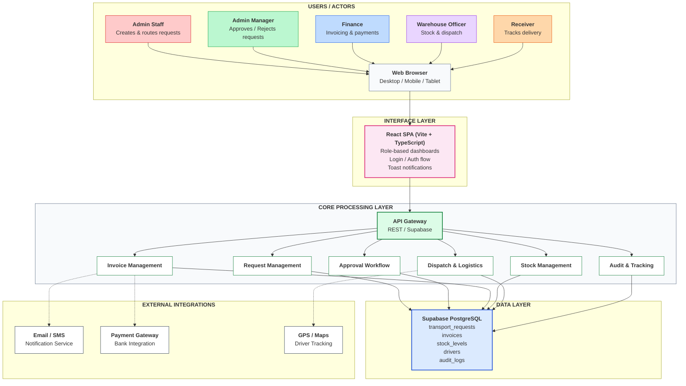

# AgroFlo — High-Level Architecture Diagram

## Mermaid Diagram



## PlantUML Source

```plantuml
@startuml
skinparam rectangle {
  BackgroundColor #f8fafc
  BorderColor #64748b
}
skinparam componentStyle rectangle

rectangle "USERS / ACTORS" {
  rectangle "Admin Staff" #fecaca as A1
  rectangle "Admin Manager" #bbf7d0 as A2
  rectangle "Finance" #bfdbfe as A3
  rectangle "Warehouse Officer" #e9d5ff as A4
  rectangle "Receiver" #fed7aa as A5
  rectangle "Web Browser\n(Desktop/Mobile/Tablet)" #f8fafc as UA
}

rectangle "INTERFACE LAYER" #fce7f3 {
  rectangle "React SPA\n(Vite + TypeScript)\nRole-based dashboards\nLogin / Auth\nToast Notifications" #ffffff as IF
}

rectangle "CORE PROCESSING LAYER" #dcfce7 {
  rectangle "API Gateway\nREST / Supabase" #bbf7d0 as GW
  
  rectangle "Request\nManagement" #ffffff as M1
  rectangle "Approval\nWorkflow" #ffffff as M2
  rectangle "Invoice\nManagement" #ffffff as M3
  rectangle "Stock\nManagement" #ffffff as M4
  rectangle "Dispatch &\nLogistics" #ffffff as M5
  rectangle "Audit &\nTracking" #ffffff as M6
}

rectangle "DATA LAYER" #dbeafe {
  rectangle "Supabase PostgreSQL\ntransport_requests\ninvoices\nstock_levels\ndrivers\naudit_logs" #ffffff as DB
}

rectangle "EXTERNAL INTEGRATIONS" #ffffff {
  rectangle "Email / SMS\nNotification Service" as E1
  rectangle "Payment Gateway\nBank Integration" as E2
  rectangle "GPS / Maps\nDriver Tracking" as E3
}

A1 --> UA
A2 --> UA
A3 --> UA
A4 --> UA
A5 --> UA

UA -down-> IF
IF -down-> GW
GW -down-> M1
GW -down-> M2
GW -down-> M3
GW -down-> M4
GW -down-> M5
GW -down-> M6

M1 -up-> DB
M2 -up-> DB
M3 -up-> DB
M4 -up-> DB
M5 -up-> DB
M6 -up-> DB

M3 ..> E1 : webhook
M3 ..> E2 : webhook
M5 ..> E3 : webhook

@enduml
```

## Layer Descriptions

| Layer | Description |
|-------|-------------|
| **Users / Actors** | All roles interact via browser. No desktop apps. |
| **Interface Layer** | Single React SPA with role-based routing. Login via auth flow, notifications via toasts. |
| **Core Processing Layer** | 6 functional modules managed by React Context (AppStore). All business logic here. Supabase client used for DB access. |
| **Data Layer** | Supabase PostgreSQL. Tables: transport_requests, invoices, stock_levels, drivers, audit_logs. |
| **External Integrations** | Email/SMS for notifications, Bank API for payments, GPS for driver tracking. |

## Data Flow

```
User → Web Browser → React SPA (Interface) → API Gateway → Core Modules
                                                              ↓
                                               Supabase PostgreSQL (Data)
                                                              ↓
                                               External Services (Email/SMS, Payment, GPS)
```