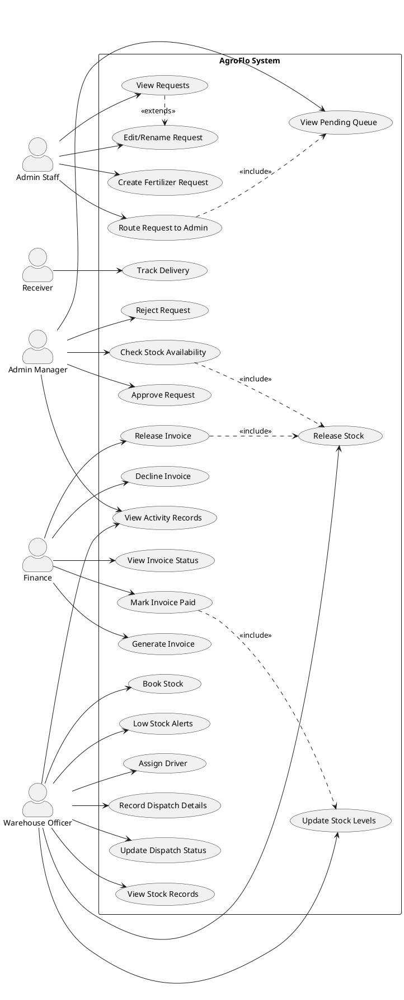
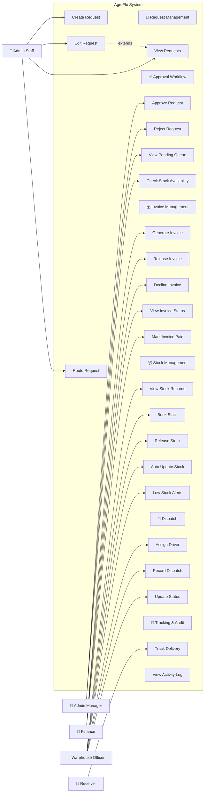

# AgroFlo — Use Case Diagram

## PlantUML Source

## Mermaid Source (GitHub-friendly)

## Actor Summary

| Actor | Role | Use Cases |
|-------|------|-----------|
| **Admin Staff** | Creates and routes fertilizer requests | Create, Edit, View, Route |
| **Admin Manager** | Approves/rejects requests, monitors SLA | Approve, Reject, View Queue, Check Stock |
| **Finance** | Manages invoicing and payment | Generate, Release, Decline Invoice; View Status; Mark Paid |
| **Warehouse Officer** | Stock and dispatch operations | View Stock, Book, Release, Assign Driver, Record Dispatch |
| **Receiver** | External party tracking delivery | Track Delivery |

## Use Case Relationships

| Relationship | Use Case A | Use Case B | Type |
|-------------|-----------|-----------|------|
| Edit extends | Edit Request | View Requests | `<<extends>>` |
| Route includes | Route Request | (precondition) | `<<include>>` |
| Approve includes | Approve Request | Check Stock | `<<include>>` |
| Release includes | Release Invoice | Release Stock | `<<include>>` |
| Mark Paid updates | Mark Invoice Paid | Update Stock | `<<include>>` |